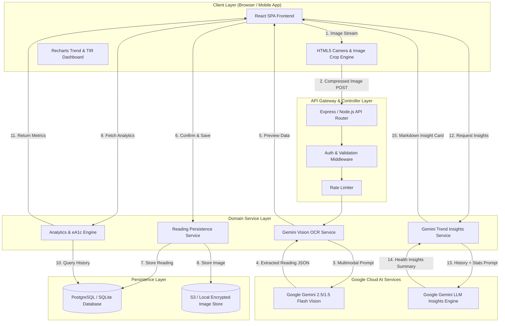

# Architecture Document (Architecture.md)
## Project Name: GlucoTrack AI

---

## 1. Executive Architectural Blueprint
GlucoTrack AI is built as a event-driven, decoupled web application. It combines client-side camera capture, a Gemini multimodal vision pipeline, relational database persistence, real-time statistical aggregations, and generative AI analytics.

---

## 2. Core Architectural Pillars

### Pillar 1: Multimodal Vision Processing Pipeline
1. **Client-side Capture:** Image captured via HTML5 MediaDevices API, cropped to display screen bounding area, compressed to `< 300 KB` payload.
2. **Vision Extraction:** Base64-encoded or streaming form-data sent to `/api/v1/ocr/extract`.
3. **Structured Response Parsing:** Gemini Vision processes image and returns JSON adhering to the `ReadingSchema`.
4. **Human-in-the-Loop (HITL) Verification:** Extracted numeric values are rendered in an editable UI modal for user confirmation before DB write.

### Pillar 2: Clinical Data Normalization & Analytics
1. **Canonical Unit Storage:** All readings stored natively in `mg/dL`. Unit conversion (`mmol/L * 18.018`) executed transparently on input/output based on user preference.
2. **Rolling Analytics Window:** Computes 7D, 14D, 30D, and 90D metrics:
   - **Average Glucose (\(\mu\))**
   - **Time-In-Range (TIR %)**
   - **Estimated A1c (\(eA1c = (\mu + 46.7) / 28.7\))**
   - **Glycemic Variability (\(SD\) and \(CV\% = (SD / \mu) \times 100\))**

### Pillar 3: Generative AI Medical Insights Engine
- Aggregates user's historical log entries, meal tags, and statistical metrics into a contextual prompt.
- Executes Gemini LLM analysis to highlight glycemic trends (e.g., dawn phenomenon, post-meal spikes, nocturnal hypoglycemia).
- Appends mandatory safety disclaimer: *"GlucoTrack AI provides analytical insights for informational purposes only. Consult your physician for medical decisions."*

---

## 3. Data Flow & Security Architecture

### Data In Transit
- All client-to-server traffic forced over **HTTPS (TLS 1.3)**.
- Sensitive user auth headers passed via secure HTTP-Only cookies or Bearer JWT tokens.

### Data At Rest
- Database encrypted using AES-256 column-level encryption for sensitive health fields.
- Images stored in secure bucket with expiring signed URLs.

### Privacy Safeguards
- Images sent to Google Gemini API are scrubbed of user names, device serial numbers, or location metadata.
- PII-stripped prompts ensure zero data retention leakage.
