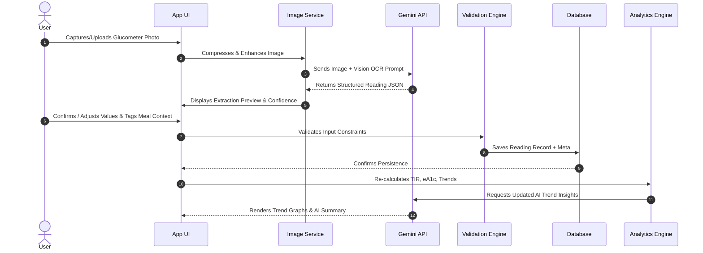

# Functional Architecture Document (FAD)
## Project Name: GlucoTrack AI

---

## 1. System Overview & Functional Scope
The Functional Architecture defines the logical decomposition of GlucoTrack AI into discrete, loosely-coupled functional modules. It traces the end-to-end data processing lifecycle from physical glucometer display capture to structured database persistence, real-time statistical aggregation, visual trend rendering, and LLM-driven medical insights.

---

## 2. Functional Module Breakdown

```
+-----------------------------------------------------------------------------------+
|                                  USER INTERFACE                                   |
|   [ Camera / Upload ]    [ Verification UI ]   [ Trend Dashboard ]   [ AI Chat ]   |
+--------------------------+---------------------+-------------------+--------------+
                           |                     |                   |
                           v                     v                   v
+-----------------------------------------------------------------------------------+
|                             CORE FUNCTIONAL SERVICES                              |
|                                                                                   |
|  +------------------------+  +------------------------+  +---------------------+  |
|  |  Image Capture & Pre-  |  |  Gemini OCR & Parsing  |  | Verification &      |  |
|  |  Processing Service    |  |  Extraction Engine     |  | Validation Rules    |  |
|  +-----------+------------+  +-----------+------------+  +----------+----------+  |
|              |                           |                          |             |
|              v                           v                          v             |
|  +-----------------------------------------------------------------------------+  |
|  |                        Reading Persistence Handler                          |  |
|  +---------------------------------------+-------------------------------------+  |
|                                          |                                        |
|  +---------------------------------------v-------------------------------------+  |
|  |                       Analytics & Calculation Engine                        |  |
|  |      - Time In Range (TIR)  - Estimated HbA1c (eA1c)  - Variability (SD)    |  |
|  +---------------------------------------+-------------------------------------+  |
|                                          |                                        |
|  +---------------------------------------v-------------------------------------+  |
|  |                        Gemini AI Insights Generator                         |  |
|  |      - Trend Analysis  - Anomaly Alerting  - Lifestyle Recommendations      |  |
|  +-----------------------------------------------------------------------------+  |
+-----------------------------------------------------------------------------------+
```

---

## 3. Detailed Functional Modules

### Module 1: Image Capture & Pre-Processing
- **Responsibilities:**
  - Access mobile browser / device camera via HTML5 Media Capture API.
  - Image cropping, aspect ratio normalization, and client-side compression (JPEG, 85% quality, max 1920x1080).
  - EXIF orientation auto-correction and contrast enhancement for dim display screens.

### Module 2: Gemini OCR & Vision Parsing Engine
- **Responsibilities:**
  - Secure API proxy connection to Google Gemini 2.5/1.5 Flash Vision.
  - Structured prompt execution returning JSON output:
    ```json
    {
      "value": 142.5,
      "unit": "mg/dL",
      "device_timestamp": "2026-09-07T08:30:00Z",
      "confidence_score": 0.96,
      "device_model": "Accu-Chek Guide",
      "detected_flags": ["post_prandial_symbol"]
    }
    ```
  - Unit normalization service (`mmol/L` to `mg/dL` standard storage conversion).

### Module 3: Verification & Manual Override Engine
- **Responsibilities:**
  - Highlight extraction results with color-coded confidence metrics (Green > 0.90, Yellow 0.70-0.89, Red < 0.70).
  - Provide inline editing fields for numeric value, unit, timestamp, and meal tags (`Fasting`, `Pre-Meal`, `Post-Meal`, `Bedtime`, `Night`).

### Module 4: Analytics & Calculation Engine
- **Responsibilities:**
  - **Glucose Averages:** 7-day, 14-day, 30-day, and 90-day rolling mean calculation.
  - **Estimated HbA1c (eA1c):** Formula: `eA1c (%) = (Mean Glucose in mg/dL + 46.7) / 28.7`.
  - **Time-In-Range (TIR) Classification:**
    - Target: `70 - 180 mg/dL`
    - High: `181 - 250 mg/dL`
    - Very High: `> 250 mg/dL`
    - Low: `54 - 69 mg/dL`
    - Very Low: `< 54 mg/dL`
  - **Glycemic Variability:** Standard Deviation (SD) and Coefficient of Variation (`CV% = (SD / Mean) * 100`). Target CV `< 36%`.

### Module 5: Gemini AI Insights & Pattern Advisor
- **Responsibilities:**
  - Formulate structured LLM prompts containing anonymized 14-day history, meal context, and statistics.
  - Generates executive summary of sugar control, highlights hypoglycemic risk periods, and suggests actionable dietary/exercise adjustments.
  - Formats output into actionable markdown cards with medical safety disclosures.

### Module 6: Visualization & Reporting Module
- **Responsibilities:**
  - Interactive multi-axis time series charts (Line/Scatter with target threshold bands).
  - Modal Day / AGP (Ambulatory Glucose Profile) overlay chart (combining multiple days into 24-hour clock).
  - Export engine for generating PDF logbooks and CSV exports for doctors.

---

## 4. End-to-End Functional Sequence


