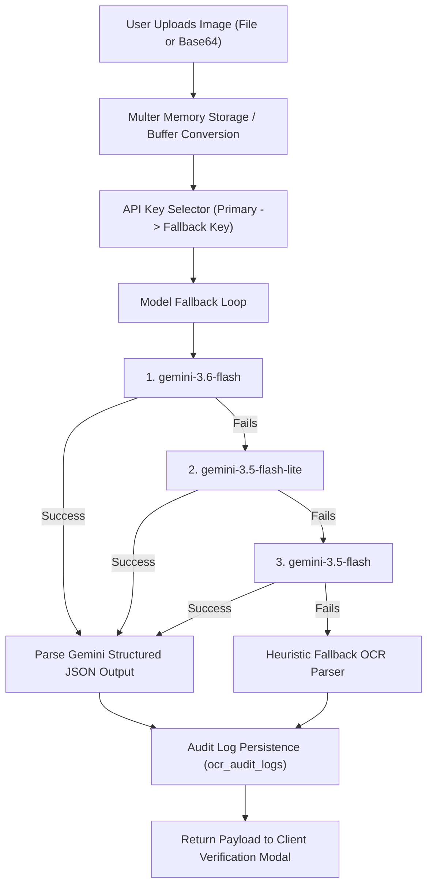

# GlucoTrack AI — AI Vision & Insights Specification

This document details the artificial intelligence architecture powering **GlucoTrack AI**, covering Computer Vision OCR for handheld glucometers and personalized metabolic pattern detection via Google Gemini.

---

## 1. Computer Vision OCR Architecture (`server/routes/ocr.js`)

### 1.1. Overview
The Vision OCR subsystem allows users to capture a photo of any LCD/LED handheld glucometer display screen. The engine extracts the raw numerical value, unit of measurement, confidence score, detected device brand, and suggested meal context without requiring manual entry.



---

## 2. Gemini Vision System Prompt & Geometry Rules

The Vision OCR prompt in [server/routes/ocr.js](file:///home/dell/glucotrack-ai/server/routes/ocr.js) includes precise domain-specific instructions:

### 2.1. OCR System Prompt Highlights
```text
You are a specialized medical computer vision assistant trained on optical character recognition (OCR) for handheld blood glucose meters (e.g. Accu-Chek, OneTouch, Contour Next, Freestyle Lite, True Metrix, Dr. Morepen, Roche, Bayer).

CRITICAL DISPLAY ANALYSIS RULES:
1. FOCUS ONLY ON GLUCOSE DISPLAY:
   - Identify the main digital display screen of the glucometer device.
   - Ignore peripheral digits such as clock time (e.g., "12:30"), date ("09/07"), memory slot indexes ("MEM 01"), or strip code numbers ("C25").
   - Extract ONLY the primary, largest numeric reading representing blood glucose level.

2. 7-SEGMENT DIGITAL DISPLAY GEOMETRY & PARSING RULES:
   - LCD displays use 7-segment digital digits. Examine segment lines carefully.
   - Distinguish '8' (all 7 segments lit) vs '0' (middle segment unlit).
   - Distinguish '6' vs '5' vs '9'.
   - Distinguish '1' vs '7'.
   - Carefully look for decimal points (e.g., "6.8" vs "68", "12.4" vs "124").

3. UNIT IDENTIFICATION RULES:
   - Check if unit text ("mg/dL" or "mmol/L") is visible on screen.
   - If unit text is unreadable/missing: values > 30 are mg/dL; values < 30 are mmol/L.

4. CONFIDENCE & CONTEXT:
   - Assign visual confidence score (0.0 to 1.0) based on clarity, lighting, and LCD contrast.
   - Detect meal context icon if present (fasting/apple core, pre-meal, post-meal).
   - Detect glucometer brand if printed on bezel or display screen.
```

---

## 3. Resilience & Fallback Mechanisms

### 3.1. API Key Rotation
If `GEMINI_API_KEY` hits a quota rate-limit (HTTP 429), the service automatically rotates to `GEMINI_API_KEY_FALLBACK` seamlessly without interrupting user flow.

### 3.2. Heuristic OCR Parser
If all Gemini models or API keys are unavailable, the system triggers an internal heuristic fallback parser that provides default baseline values (`120.0 mg/dL`, confidence `0.5`) and sets `processed_by_ai: false`, allowing user correction in the interactive Verification Modal.

---

## 4. Gemini AI Health Insights Engine (`server/routes/ai.js`)

### 4.1. Mathematical & Statistical Formulas
Before building the LLM context prompt, the backend executes precise glycemic calculations over the reading window:

#### 1. Mean Glucose (\(\bar{G}\))
\[
\bar{G} = \frac{1}{N} \sum_{i=1}^{N} G_i
\]

#### 2. Estimated HbA1c (eA1c ADAG Formula)
\[
eA1c (\%) = \frac{\bar{G} + 46.7}{28.7}
\]

#### 3. Standard Deviation (SD) & Coefficient of Variation (CV%)
\[
SD = \sqrt{\frac{1}{N} \sum_{i=1}^{N} (G_i - \bar{G})^2}, \quad CV(\%) = \left( \frac{SD}{\bar{G}} \right) \times 100
\]

#### 4. Time-In-Range (TIR) Standard Ranges
- **Very Low**: \(< 54 \text{ mg/dL}\)
- **Low**: \(54 - 69 \text{ mg/dL}\)
- **In Range (Target)**: \(70 - 180 \text{ mg/dL}\)
- **High**: \(181 - 250 \text{ mg/dL}\)
- **Very High**: \(> 250 \text{ mg/dL}\)

---

## 5. Non-Diagnostic Medical Safety Protocol

> [!IMPORTANT]
> **Medical Disclaimer Policy**: GlucoTrack AI insights are engineered to provide educational and behavioral support. The system strictly includes mandatory non-diagnostic disclaimers:
> *"The information provided by GlucoTrack AI is for educational and tracking purposes only. It is not intended as medical advice, diagnosis, or treatment planning. Always consult a qualified healthcare provider for clinical decisions."*
