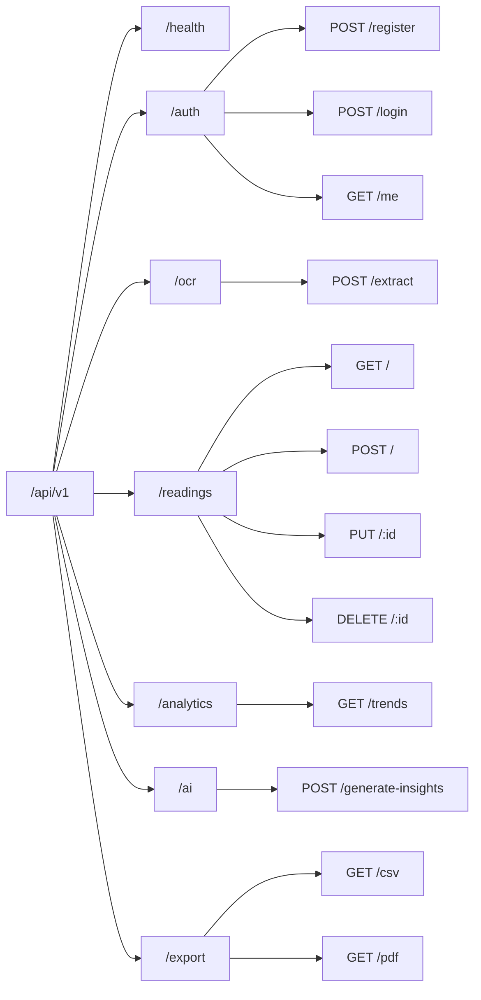

# GlucoTrack AI — API Specification

This document provides a comprehensive REST API reference for **GlucoTrack AI**, detailing authentication, request headers, query parameters, payload bodies, response structures, and error codes.

---

## 1. General Principles & Headers

### 1.1. Base URL & Versioning
All API endpoints are versioned and mounted under the `/api/v1` prefix:
```http
http://localhost:5000/api/v1
```

### 1.2. Request Headers
| Header Name | Required | Description |
| :--- | :--- | :--- |
| `Content-Type` | Optional* | `application/json` (or `multipart/form-data` for file uploads). |
| `Authorization` | Mandatory for protected routes | Bearer token format: `Bearer <jwt_token_string>`. |

---

## 2. API Endpoints Catalog



---

## 3. Detailed Endpoint Reference

### 3.1. System & Healthcheck

#### `GET /api/v1/health`
Checks API server availability and system status.
- **Authentication**: None required.
- **Response `200 OK`**:
```json
{
  "status": "healthy",
  "service": "GlucoTrack AI API Server",
  "version": "1.0.0",
  "timestamp": "2026-09-08T19:10:00.000Z"
}
```

---

### 3.2. Authentication (`/api/v1/auth`)

#### `POST /api/v1/auth/register`
Registers a new user account and returns a JWT access token.
- **Request Body**:
```json
{
  "email": "user@example.com",
  "password": "SecurePassword123",
  "full_name": "Jane Doe",
  "preferred_unit": "mg/dL",
  "target_low_mgdl": 70,
  "target_high_mgdl": 180
}
```
- **Response `201 Created`**:
```json
{
  "status": "success",
  "token": "eyJhbGciOiJIUzI1NiIsInR5cCI6IkpXVCJ9...",
  "user": {
    "id": "usr_1725800000_a1b2c",
    "email": "user@example.com",
    "full_name": "Jane Doe",
    "preferred_unit": "mg/dL",
    "target_low_mgdl": 70,
    "target_high_mgdl": 180
  }
}
```

#### `POST /api/v1/auth/login`
Authenticates user credentials and issues a JWT token.
- **Request Body**:
```json
{
  "email": "user@example.com",
  "password": "SecurePassword123"
}
```
- **Response `200 OK`**:
```json
{
  "status": "success",
  "token": "eyJhbGciOiJIUzI1NiIsInR5cCI6IkpXVCJ9...",
  "user": {
    "id": "usr_1725800000_a1b2c",
    "email": "user@example.com",
    "full_name": "Jane Doe",
    "preferred_unit": "mg/dL"
  }
}
```

#### `GET /api/v1/auth/me`
Retrieves current authenticated user details.
- **Authentication**: `Bearer <token>`
- **Response `200 OK`**: Returns current user object.

---

### 3.3. Gemini Vision OCR Engine (`/api/v1/ocr`)

#### `POST /api/v1/ocr/extract`
Processes a glucometer display image using Gemini Vision API to extract numeric glucose reading, unit, and confidence metrics.
- **Content-Type**: `multipart/form-data` (form key: `image`) OR `application/json` (key: `image_base64`).
- **Response `200 OK`**:
```json
{
  "status": "success",
  "data": {
    "value": 126.0,
    "unit": "mg/dL",
    "confidence": 0.96,
    "detected_timestamp": null,
    "suggested_meal_context": "fasting",
    "device_brand": "Accu-Chek",
    "ocr_log_id": "ocr_1725800000_x9y8z",
    "processed_by_ai": true
  }
}
```

---

### 3.4. Glucose Readings (`/api/v1/readings`)

#### `GET /api/v1/readings`
Fetches a filterable list of glucose readings logged by the user.
- **Query Parameters**:
  - `context` *(string, optional)*: Filter by context (`fasting`, `pre_meal`, `post_meal`, `bedtime`, `random`).
  - `search` *(string, optional)*: Search term across notes or original values.
  - `limit` *(integer, optional)*: Max records to return (default: `100`).
- **Response `200 OK`**:
```json
{
  "status": "success",
  "total": 42,
  "count": 1,
  "data": [
    {
      "id": "rdg_1725800100_k3j2h",
      "user_id": "usr_1725800000_a1b2c",
      "value_mgdl": 126.0,
      "original_value": 126.0,
      "original_unit": "mg/dL",
      "meal_context": "fasting",
      "notes": "Morning fasting check",
      "measured_at": "2026-09-08T08:00:00.000Z",
      "created_at": "2026-09-08T08:01:00.000Z"
    }
  ]
}
```

#### `POST /api/v1/readings`
Records a new blood glucose measurement.
- **Request Body**:
```json
{
  "value": 7.0,
  "unit": "mmol/L",
  "meal_context": "post_meal",
  "notes": "Post lunch measurement",
  "measured_at": "2026-09-08T13:30:00.000Z",
  "ocr_log_id": "ocr_1725800000_x9y8z",
  "is_edited": false
}
```
- **Response `201 Created`**: Returns created reading payload with converted `value_mgdl` (7.0 * 18.018 = 126.1).

#### `PUT /api/v1/readings/:id`
Updates an existing reading entry.
- **Response `200 OK`**: Returns updated record object.

#### `DELETE /api/v1/readings/:id`
Deletes a specific reading entry by ID.
- **Response `200 OK`**: `{ "status": "success", "message": "Reading deleted successfully." }`

---

### 3.5. Analytics & Trends (`/api/v1/analytics`)

#### `GET /api/v1/analytics/trends`
Computes statistical metrics, Time-In-Range percentages, and meal averages over a specified timeframe.
- **Query Parameters**: `days` *(integer, default: 14)*.
- **Response `200 OK`**:
```json
{
  "status": "success",
  "period_days": 14,
  "summary": {
    "total_readings": 28,
    "average_mgdl": 134.5,
    "estimated_a1c": 6.3,
    "sd": 24.2,
    "cv_percent": 18.0,
    "time_in_range": {
      "very_low_pct": 0.0,
      "low_pct": 3.6,
      "in_range_pct": 85.7,
      "high_pct": 10.7,
      "very_high_pct": 0.0
    }
  },
  "readings_timeline": [...],
  "meal_averages": [...]
}
```

---

### 3.6. AI Health Insights Engine (`/api/v1/ai`)

#### `POST /api/v1/ai/generate-insights`
Generates personalized, contextual metabolic insights powered by Google Gemini LLM.
- **Request Body**: `{ "periodDays": 14 }`
- **Response `200 OK`**:
```json
{
  "status": "success",
  "data": {
    "period_days": 14,
    "summary_markdown": "### Executive Summary\nYour glycemic control over the past 14 days is stable with an estimated HbA1c of **6.3%**...",
    "detected_patterns": [
      {
        "title": "Post-Breakfast Elevation",
        "severity": "medium",
        "description": "Readings following breakfast average 162 mg/dL, compared to overall mean of 134.5 mg/dL."
      }
    ]
  }
}
```

---

### 3.7. Data Export (`/api/v1/export`)

#### `GET /api/v1/export/csv`
Downloads a CSV spreadsheet file containing complete user reading history.
- **Content-Disposition**: `attachment; filename="Glucose_Export_<timestamp>.csv"`

#### `GET /api/v1/export/pdf`
Generates a printable clinical summary HTML/PDF report suitable for physician review.
