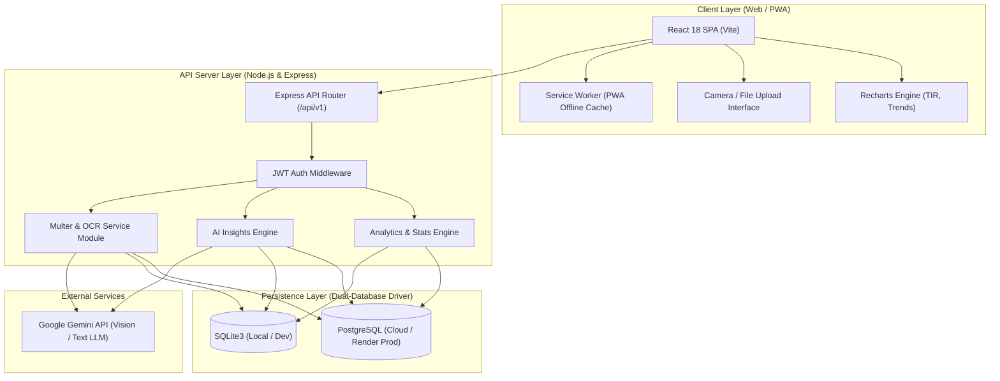
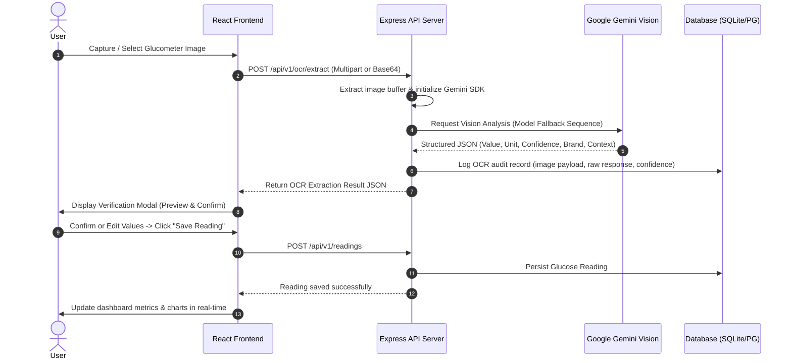
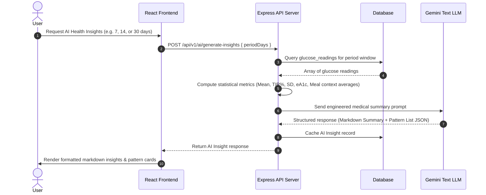
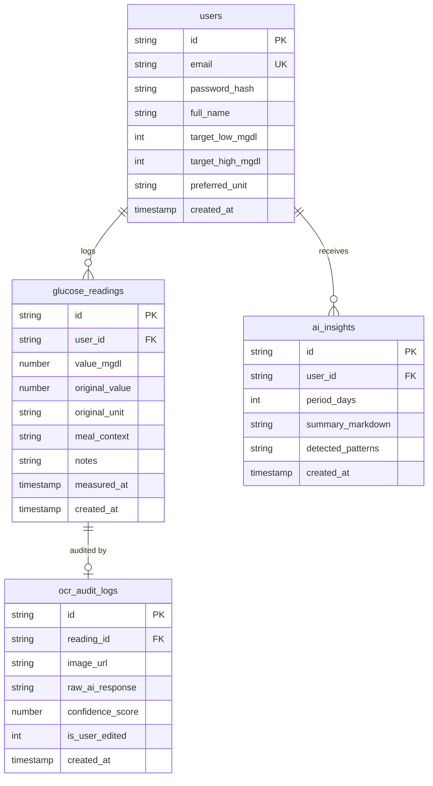

# GlucoTrack AI — System Architecture & Design Specification

This document provides a detailed overview of the system architecture, component interaction, data flow, dual-database design, and security model for **GlucoTrack AI**.

---

## 1. High-Level System Architecture

GlucoTrack AI is built as a full-stack, decoupled Web/PWA application with a Node.js Express API server and a React single-page application.



---

## 2. Component Taxonomy & Responsibilities

### 2.1. Frontend Tier (`src/`)
- **App Core (`src/App.jsx`)**: Main state coordinator, active tab controller, global readings listener, modal manager.
- **Component Modules (`src/components/`)**:
  - `Header.jsx`: Branding header, quick action buttons, user auth menu.
  - `HeroCapture.jsx`: Hero call-to-action block for camera/upload trigger.
  - `CameraModal.jsx`: Web camera viewfinder, file picker, base64 encoder.
  - `VerificationModal.jsx`: Interactive post-OCR verification dialog allowing user confirmation and manual edit overrides.
  - `QuickStats.jsx`: Metric counters (Latest Reading, Average Glucose, eA1c, TIR percentage).
  - `GlucoseTrendChart.jsx`: Dynamic line charts with target threshold bands (70–180 mg/dL).
  - `TIRDonutChart.jsx`: Recharts pie/donut visualization for glycemic range distribution.
  - `MealContextChart.jsx`: Bar chart breaking down glucose averages by meal context tags.
  - `LogbookTable.jsx`: Filterable, searchable reading history table with edit and deletion controls.
  - `AIHealthInsights.jsx`: Gemini-generated markdown insight report viewer and pattern detection card list.
  - `AuthModal.jsx`: Login / Register form modal with JWT token management.
  - `SidePanel.jsx`: Mobile/desktop slide-out navigation panel.
  - `PWAInstallModal.jsx`: Browser PWA installation banner prompt.
- **PWA Service Worker (`src/pwaRegister.js`)**: Handles offline caching of static assets and service worker registration.

### 2.2. Backend Tier (`server/`)
- **API Server Entry (`server/index.js`)**: Express server config, CORS setup, route mounting, static dist serving, and Render anti-idle keep-alive background worker.
- **Database Abstraction (`server/db.js`)**: Dual-engine wrapper enabling transparent SQL execution across SQLite and PostgreSQL.
- **Route Controllers (`server/routes/`)**:
  - `auth.js`: User registration, login, bcrypt password hashing, and JWT token issuance.
  - `ocr.js`: Image payload parsing, Gemini Vision API invocation, bounding box extraction, and fallback parsing.
  - `readings.js`: CRUD endpoints for blood glucose measurements.
  - `analytics.js`: Statistical computations (TIR breakdown, eA1c formula, SD, CV%).
  - `ai.js`: Aggregates reading history into prompt context for Gemini AI health recommendations.
  - `export.js`: Formatted CSV and clinical report export generators.

---

## 3. Data Flow Diagrams

### 3.1. Vision OCR Extraction Lifecycle



### 3.2. AI Health Insights Lifecycle



---

## 4. Dual-Database Abstraction Layer

GlucoTrack AI implements a zero-configuration dual database architecture in [server/db.js](file:///home/dell/glucotrack-ai/server/db.js).

### 4.1. Automatic Engine Selection
- **PostgreSQL Mode**: Automatically activated when the `DATABASE_URL` environment variable is detected (e.g. cloud hosting on Render with Render PostgreSQL).
- **SQLite3 Mode**: Activated automatically for local development or lightweight container deployments. Storage defaults to `./glucotrack.db` or persistent mount volume path `/app/data/glucotrack.db`.

### 4.2. Query Parameter Formatting (`formatSql`)
PostgreSQL uses `$1, $2, $3` positional placeholders, while SQLite uses `?`. The abstraction layer inspects queries at runtime and transforms placeholders automatically:

```javascript
function formatSql(sql) {
  if (!isPg) return sql;
  let index = 1;
  return sql.replace(/\?/g, () => `$${index++}`);
}
```

### 4.3. Database Schema



---

## 5. Security Architecture & Medical Safety Guardrails

1. **Authentication & Authorization**: Password hashing with `bcryptjs` (salt rounds: 10). Access tokens signed using JSON Web Tokens (JWT) with configurable secret expiration.
2. **Payload Protection**: Express body parsers capped at 20MB to protect against memory exhaustion during base64 image uploads.
3. **Non-Diagnostic AI Disclaimers**: All AI insight prompts and UI renders strictly include medical safety disclaimers emphasizing that generated content is for informational purposes only and does not constitute medical diagnosis or prescription advice.
4. **Data Isolation**: Database queries enforce user isolation (`WHERE user_id = ?`) across all endpoints.
