# GlucoTrack AI — Frontend Architecture & PWA Guide

This document describes the user interface architecture, component taxonomy, state reactivity model, data visualization engine, and Progressive Web App (PWA) features of **GlucoTrack AI**.

---

## 1. Frontend Technology Stack

| Layer | Technology | Description |
| :--- | :--- | :--- |
| **UI Framework** | React 18 | Declarative component architecture with modern hooks (`useState`, `useEffect`, `useCallback`). |
| **Build Tool** | Vite 5 | Fast HMR development server and optimized bundle generation. |
| **Icons** | Lucide React | Modern, lightweight icon suite. |
| **Data Visualization** | Recharts 2 | Responsive SVG chart library for trend lines, donut breakdowns, and bar charts. |
| **Styling** | Vanilla CSS (`src/index.css`) | Custom design system using CSS variables, glassmorphism card surfaces, and dark mode aesthetic. |
| **PWA Engine** | Service Worker (`src/pwaRegister.js`) | Offline asset caching and web app manifest integration. |

---

## 2. Component Taxonomy & Structure

```mermaid
graph TD
    App["App Core (App.jsx)"]
    App --> Header["Header.jsx"]
    App --> Hero["HeroCapture.jsx"]
    App --> QuickStats["QuickStats.jsx"]
    App --> TrendChart["GlucoseTrendChart.jsx"]
    App --> TIRChart["TIRDonutChart.jsx"]
    App --> MealChart["MealContextChart.jsx"]
    App --> Logbook["LogbookTable.jsx"]
    App --> AIView["AIHealthInsights.jsx"]

    App --> CamModal["CameraModal.jsx"]
    App --> VerifModal["VerificationModal.jsx"]
    App --> AuthModal["AuthModal.jsx"]
    App --> SidePanel["SidePanel.jsx"]
    App --> PWAModal["PWAInstallModal.jsx"]
```



---

## 3. Global State & Event Reactivity Model

### 3.1. Real-time Event Dispatcher (`readingsUpdated`)
To ensure decoupled components synchronize state instantly when a glucose reading is added, modified, or removed, the app utilizes a custom browser event pipeline:

```javascript
// Triggering update in modal/table component:
window.dispatchEvent(new Event('readingsUpdated'));

// Listening for updates in App.jsx / Stats components:
useEffect(() => {
  const handleUpdate = () => fetchReadingsAndStats();
  window.addEventListener('readingsUpdated', handleUpdate);
  return () => window.removeEventListener('readingsUpdated', handleUpdate);
}, []);
```

### 3.2. Unit Switching Context (`mg/dL` <-> `mmol/L`)
The user can switch preferred display units at any time from the UI header. All charts and data tables recalculate displayed values dynamically using standard unit conversion ratios:
- **Conversion Factor**: \(1 \text{ mmol/L} = 18.018 \text{ mg/dL}\)
- Storage retains canonical values in `mg/dL` (`value_mgdl`) as well as original measured value (`original_value`) and unit (`original_unit`).

---

## 4. Recharts Visualization Engine

### 4.1. Glucose Trend Line Chart (`src/components/GlucoseTrendChart.jsx`)
- Displays chronological blood sugar values with target range bands highlighted between 70 mg/dL and 180 mg/dL.
- Color-coded data dots:
  - 🟢 **Green**: In Target Range (70–180 mg/dL)
  - 🔴 **Red**: Hypoglycemic / Low (< 70 mg/dL)
  - 🟡 **Yellow**: Hyperglycemic / High (> 180 mg/dL)

### 4.2. Time-In-Range Donut Chart (`src/components/TIRDonutChart.jsx`)
- Multi-segment pie donut rendering five clinical glycemic zones:
  1. **Very High (>250 mg/dL)** — Deep Purple
  2. **High (181–250 mg/dL)** — Amber / Yellow
  3. **In Range (70–180 mg/dL)** — Emerald Green
  4. **Low (54–69 mg/dL)** — Orange
  5. **Very Low (<54 mg/dL)** — Crimson Red

---

## 5. Progressive Web App (PWA) & Offline Strategy

GlucoTrack AI is built as a installable Progressive Web App.

### 5.1. Features
- **Installability**: Can be installed to desktop or mobile home screens with native application feel.
- **Service Worker (`src/pwaRegister.js`)**: Intercepts fetch requests to serve cached application shell files during network dropouts.
- **Offline Resilience**: Offline indicators notify users if internet connectivity is lost while continuing to support local reading viewing.
- **Web App Manifest (`public/manifest.json`)**: Configures app name, icons (`192x192`, `512x512`), display mode (`standalone`), and theme background colors.
